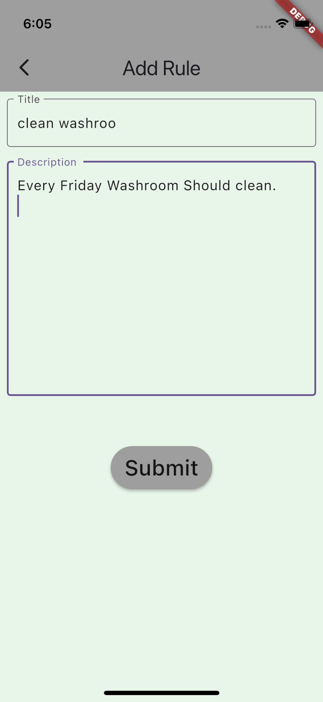
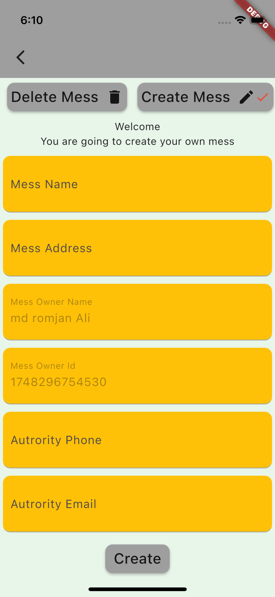
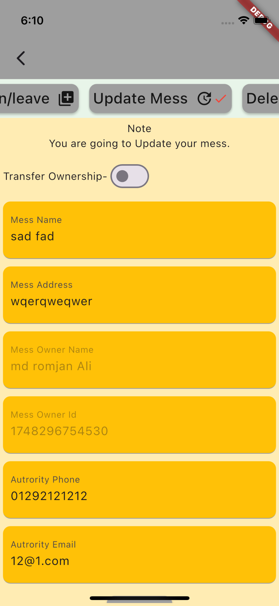
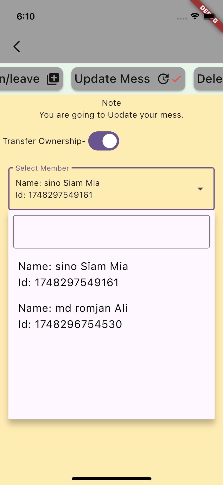
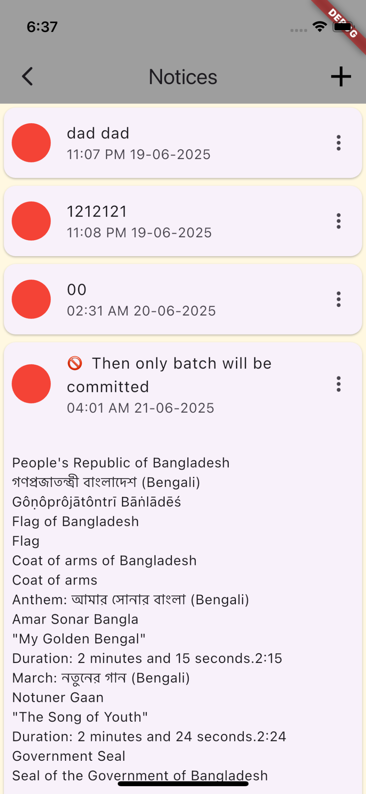
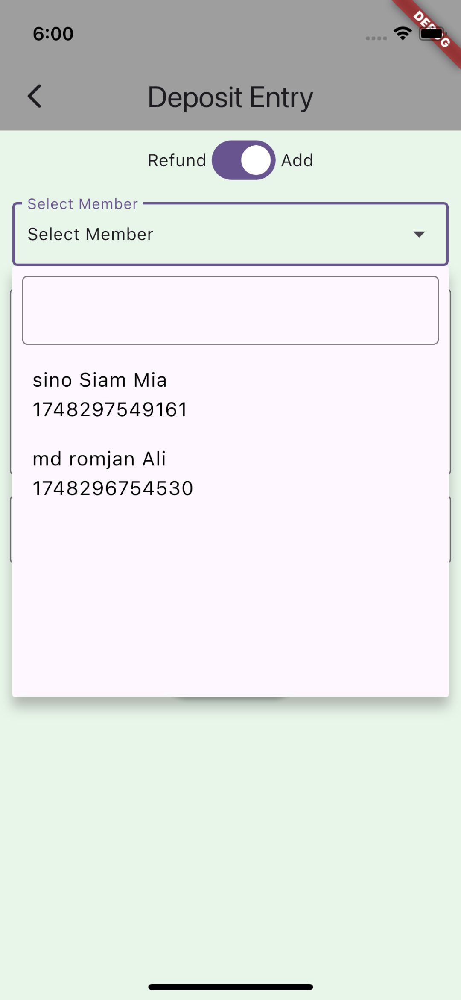
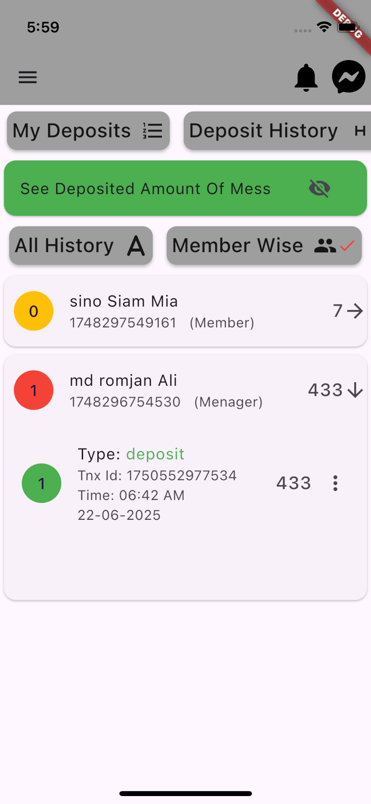
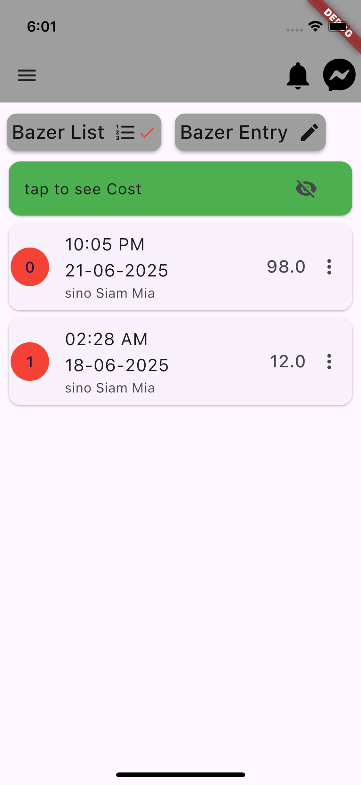

# Project Name: Mess Management

in this application user can manage there meal, diposite, fund, meal rate, bazer, total member data, Administrator Power,
In this app has managed user Privacy, security with Confidentiallity, Integrity, Availability

user can read and write online or offline.

backend : firebase

# preview : ------

# Authentication 

Landing Screen

Sign Up

Sign In

Reset Password

# Home 

Home

Drawer 

# Mess

About Mess

Add Mess Rule

Create A Mess

Delete Your Mess

Mess Update

Join or Leave

Transfer Ownership

# Notices 

Notices

# Member 

Find And Add Member

Member List

# Deposit 

Add Deposit 

Depsoit History Member Wise

My Deposit List

Add Deposit

All Deposit History

# Meal 

Add Meal

Group Meal List 

My Meal List

Member Meal List 

# Fund 

Add Fund

Fund Transaction List

# Bazer 

Bazer Entry

Bazer List

# Setting 

Change Email

Change Info

Change Pass

Logout

